十九、从0开始卷出一个新项目之瑞萨RZN2L适配YT8522H/YT8512H
===
[toc]

# 一、概述
1、瑞萨FSP支持ksz8081等多个phy型号，rtt的etherkit支持RTL8211F。YT8522H/YT8512H的适配有哪些不同呢？
2、我们从RZN2L适配YT8522H/YT8512H的过程中总结phy适配的关键点
3、YT8522H横向对比---总结不同的根本原因

# 二、相关资料
- [r01an6560ej0110-rzt2m-rzn2l-rzt2l-lwip.pdf](./Doc/r01an6560ej0110-rzt2m-rzn2l-rzt2l-lwip.pdf)
- [CN032-4 Coupler Solution_SCH.pdf](./Doc/CN032-4%20Coupler%20Solution_SCH.pdf)
- [C22472313_以太网收发器_YT8522H_规格书_WJ1193249.PDF](./Doc/C22472313_以太网收发器_YT8522H_规格书_WJ1193249.PDF)
- [YT8512_reference_design_v1.2_20200612.pdf](./Doc/YT8512_reference_design_v1.2_20200612.pdf)
- [EtherKit_Board_Schematic.pdf](./Doc/EtherKit_Board_Schematic.pdf)
- https://www.motor-comm.com/product/ethernet-physical-layer-chip
# 三、RZN2L适配YT8522H例程和步骤

## 3.1 例程见GitHub和gitee
- https://github.com/cl234583745/rzn2l
- https://gitee.com/292812832/rzn2l

## 3.2 步骤

总结：FSP的board、pins、stack(gmac)配置修过   和   YT8522H初始化函数

- 自定义board

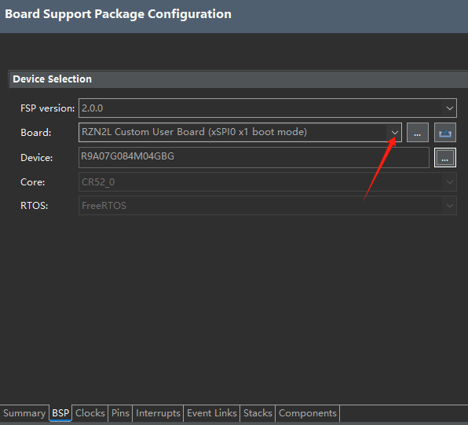

- 自定义引脚配置文件

主要是MII接口引脚

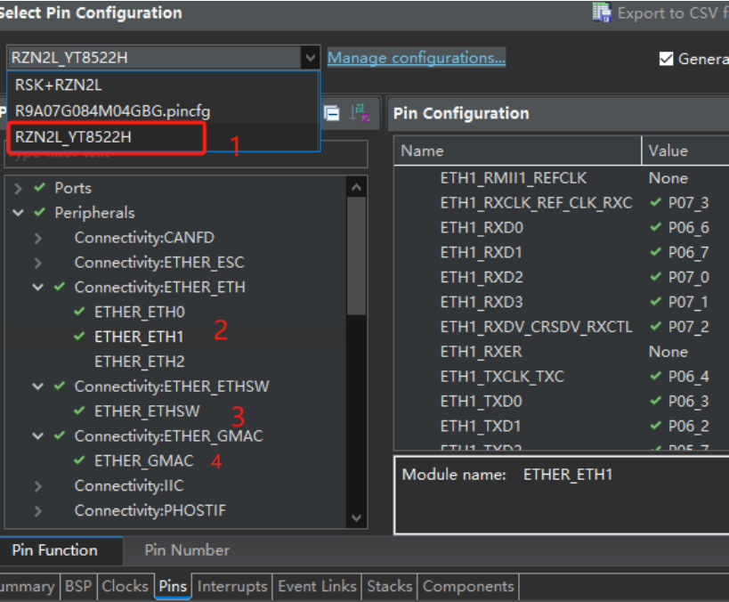

- phy地址和自定义初始化函数

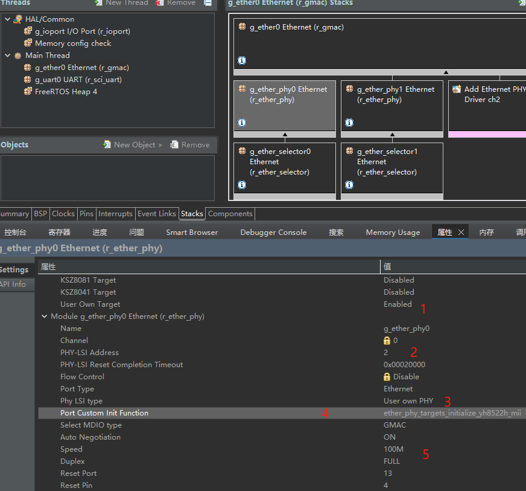
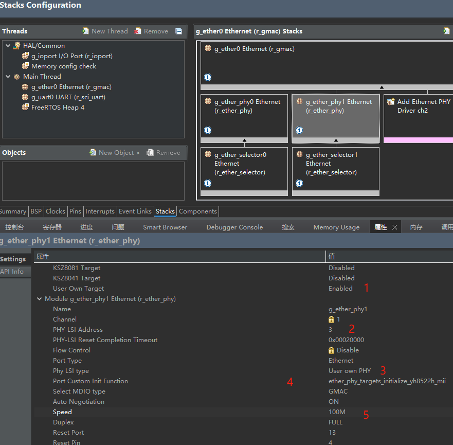
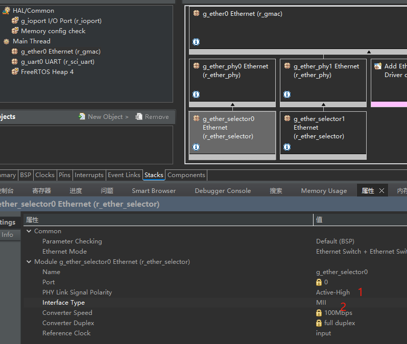
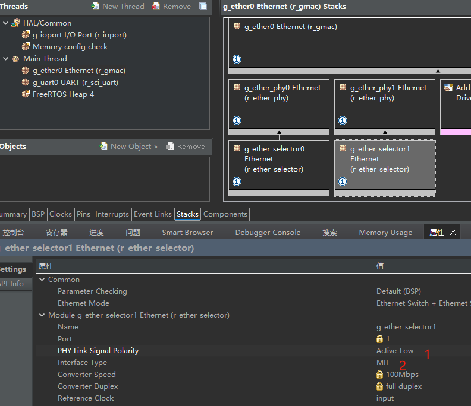

- YT8522H初始化函数的实现

```
void ether_phy_targets_initialize_yh8522h_mii(ether_phy_instance_ctrl_t *p_instance_ctrl)
{
    USR_LOG_INFO( "yh8512h_mii phy address=%d", p_instance_ctrl->p_ether_phy_cfg->phy_lsi_address );

    #define ETHER_PHY_REG_DEBUG_REGISTER_ADDRESS_OFFSET     0x1E
    #define ETHER_PHY_REG_DEBUG_REGISTER_DATA               0x1F

    R_ETHER_PHY_Write(p_instance_ctrl,ETHER_PHY_REG_DEBUG_REGISTER_ADDRESS_OFFSET, 0x40C0);
    R_ETHER_PHY_Write(p_instance_ctrl,ETHER_PHY_REG_DEBUG_REGISTER_DATA, 0x030);
    R_ETHER_PHY_Write(p_instance_ctrl,ETHER_PHY_REG_DEBUG_REGISTER_ADDRESS_OFFSET, 0x40C3);
    R_ETHER_PHY_Write(p_instance_ctrl,ETHER_PHY_REG_DEBUG_REGISTER_DATA, 0x0320);
}
```

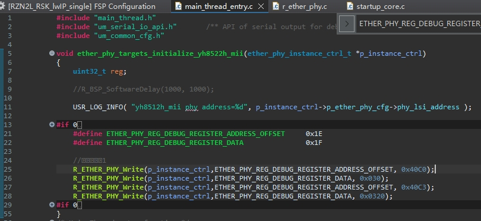

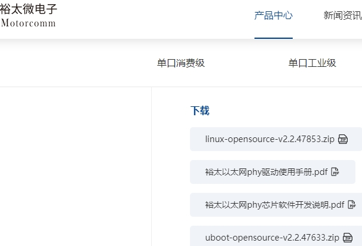

- FSP的phy初始化流程

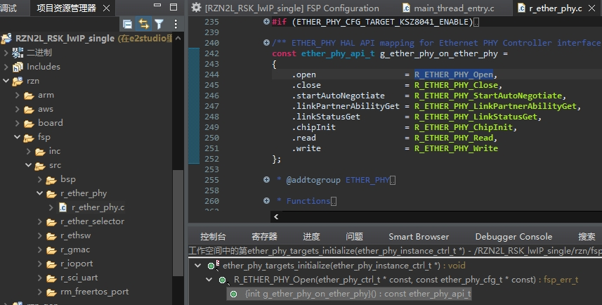

- FSP2.0 bug(FSP2.1已经修复)

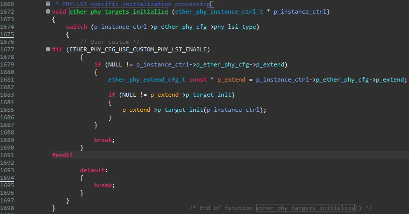

- 验证效果

观看网口灯
EtherCAT连接主站，测试OP
Ethernet ping 板子

# 四、phy适配关键点：phy地址、phy link、phy寄存器初始化
phy的引脚和配置通常可以多次核对避免出错，phy地址、phy link、phy初始化经常没有深入理解导致配置错误。

## 4.1 phy地址
phy地址012，推荐配置123，0通常为广播。也要注意地址偏移

## 4.2 phy link
当我们说 “PHY Link”，它实际上是一个综合状态，包含：物理层连接建立、自动协商、硬件信号有效、状态寄存器置位等。

- phy 状态寄存器：mac层可读
- mcu  PHY link status input引脚：接phy的LED引脚，即：phy link信号极性

## 4.3 phy寄存器初始化
YT8522H等phy有扩展寄存器，扩展寄存器也是需要额外注意的


# 五、YT8522H横向对比

总结：YT8522H phy地址和phy link均使用phy的led引脚配置（ksz8081、RTL8211F分别由RXD/payload引脚和LED引脚配置），由此引起phy地址和phy link极性有相关性。

- ksz8081

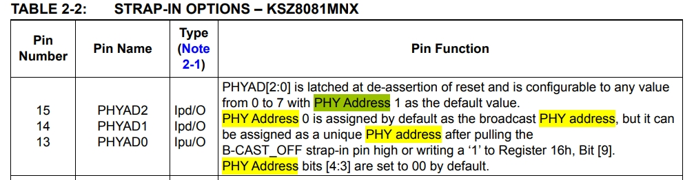
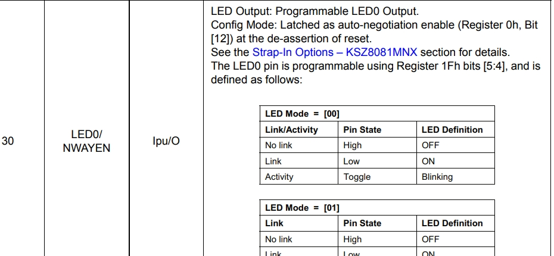
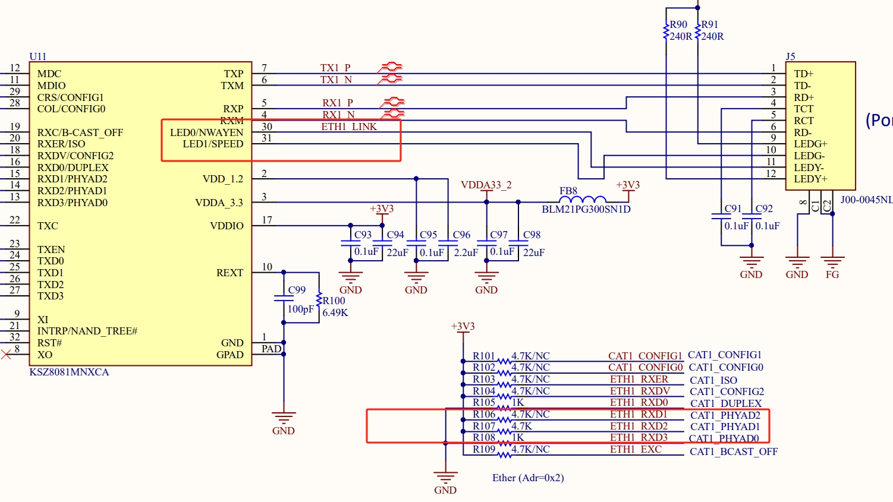

- RTL8211F

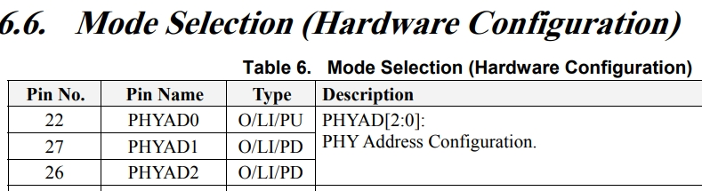
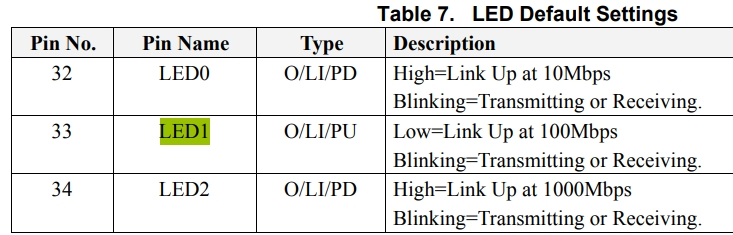
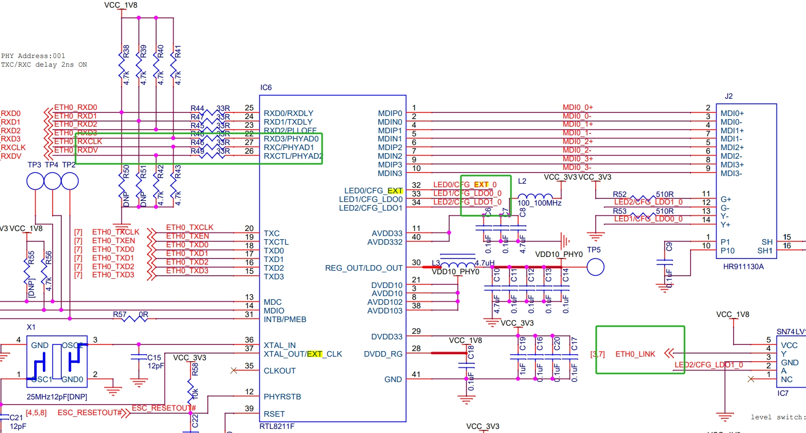

- YT8512H/YT8522H

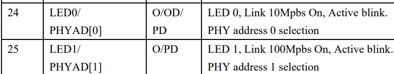
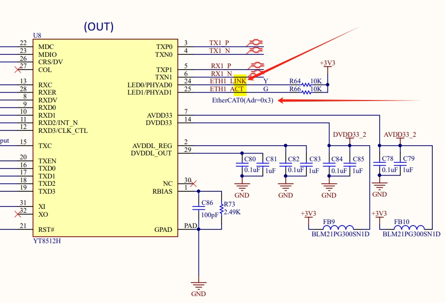


# 六、总结
- 瑞萨FSP提供了完整的自定义phy功能，驱动和应用解耦，适配多套配置，自动生成代码
- phy适配关键点：phy地址、phy link、phy寄存器初始化
- YT8522H phy地址和phy link均使用phy的led引脚配置
- 也要注意phy的复位、电源管理等其他功能

