二十二、RJ45黄绿指示灯闪烁的“底层逻辑”
===
[toc]
# 一、目的/概述
- 1、一般来说，绿灯常亮表示连接Link，黄灯闪烁表示数据通讯Activity。但是也经常会看到反着来的。
- 2、硬件如何设计、软件如何配置可以达到任意切换效果吗？
- 3、是否与以太网多协议有关系呢？
    什么是phylink？
    stm32F407为什么没有phylink？
    phylink、phy地址、RJ45黄绿指示灯、LED引脚功能，四者又有什么关系？
- 4、该问题涉及/影响的功能较多，需要根据不同phy芯片进行硬件设计和软件配置,
  **总结一条原则：优先link接RJ45绿灯**

# 二、资料来源
似乎没有什么组织或标准规定RJ45黄绿指示灯闪烁规则，我们参考半导体公司开发板参考设计

# 三、PHY芯片的LED模式和LED引脚
- 1、百兆PHY通常有2个LED引脚，千兆PHY通常3个LED引脚
- 2、PHY寄存器可以配置LED MODE，即LED引脚指示的功能
- 3、百兆PHY的LED引脚通常有3个功能：Link(连接)、Activity(数据通信)、Speed(10、100M)，注意不同品牌的phy措词不一样，不能弄混了
- 4、引用文章：https://kb.hpmicro.com/2025/03/28/esc%e9%85%8d%e7%bd%aephy%e7%9a%84%e7%a4%ba%e4%be%8b/

- 例子1：KSZ8081
LED Mode默认0，LED0 LED1指示了speed、Link、Activity三种状态
LED Mode    1，LED0 LED1指示了Link、Activity两种状态

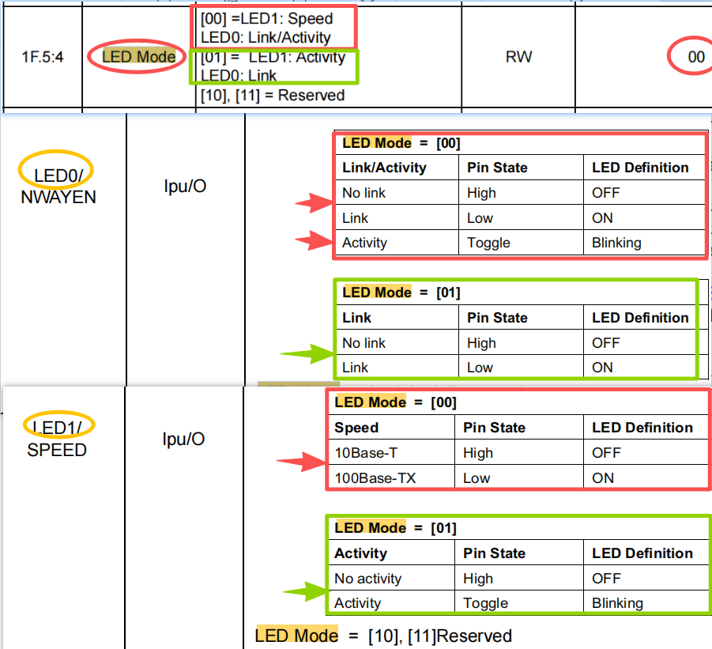

- 例子2：YT8512H
配置1：
参见文章[十九、瑞萨RZN2L适配YT8522H/YT8512H](https://mp.weixin.qq.com/s/gqh21Vyu1u9zX1DuiSvQfg)
寄存器0x40C0配置0x0030--->LED0--->常亮--->Link
寄存器0x40C3配置0x0320--->LED1--->闪烁--->Activity
LED0 LED1还有phy地址选择功能

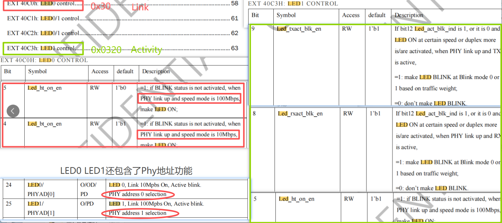

配置2：
寄存器0x40C0配置0x1300--->LED0--->闪烁--->Activity
寄存器0x40C3配置0x0020--->LED1--->闪烁--->Link

- 5、**总结：phy寄存器可以配置LED引脚的功能，主要是就LED0/1对应Link/Activity，但未涉及到RJ45的黄绿指示灯**。部分phy芯片LED引脚还复用了phy地址选择功能。

# 四、PHY link状态和PHY Link引脚
- 1、多种获取PHY link状态的方式：
    -  1) mcu可以通过MDIO接口读取PHY状态寄存器，从而获取PHY link状态
    -  2) mcu可以通过PHY Link引脚获取PHY link状态
    -  3) RJ45指示灯也可以指示PHY link状态
- 2、stm32f407 h563灯没有PHY Link引脚，瑞萨的ra6 ra8等有

Ra6m5 phylink引脚：
https://doc.embedfire.com/mcu/renesas/fsp_ra/zh/latest/doc/chapter34/chapter34.html?highlight=linksta#id16

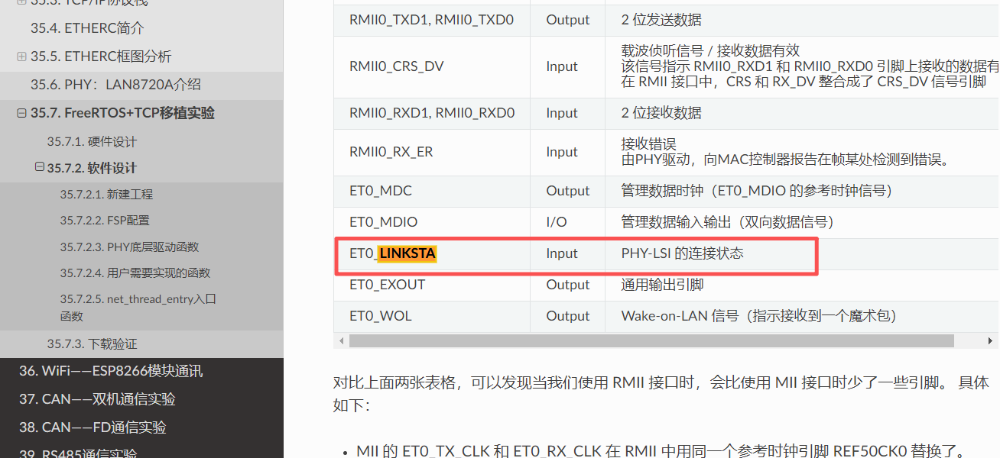

- PHY Link引脚的优势在哪里？
稍微权威一点的资料可以找到TI的文档：

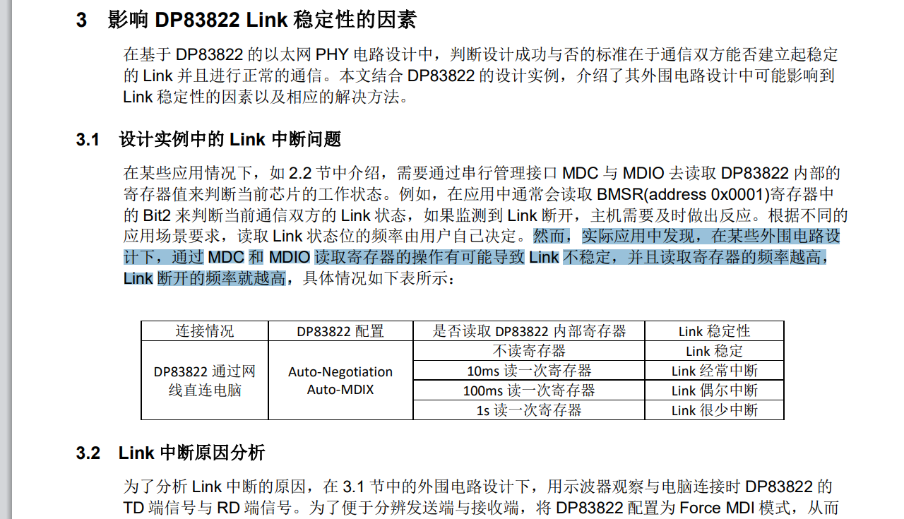
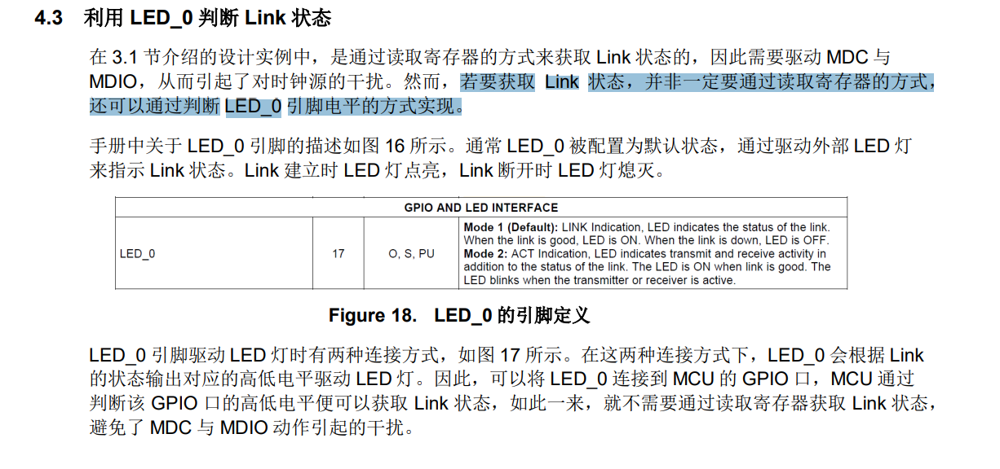

# 五、通信协议和硬件设计带来的影响
1、测试lwip协议栈工程，可修改LED引脚功能，驱动RJ45黄绿灯不同闪烁模式
2、ethercat、profinet工程，需要修改硬件设计，无法通过软件修改
3、分析可能的原因就是ESC必须通过PHY Link引脚获取Link状态，传统的LWIP通过MDIO接口获取Link状态

# 六、RJ45黄绿灯到底哪个闪烁？
- 1、F28P65X黄灯常亮(Link)，绿灯闪烁(Activity)
https://www.ti.com.cn/lit/df/sprr478a/sprr478a.pdf?ts=1757397346621

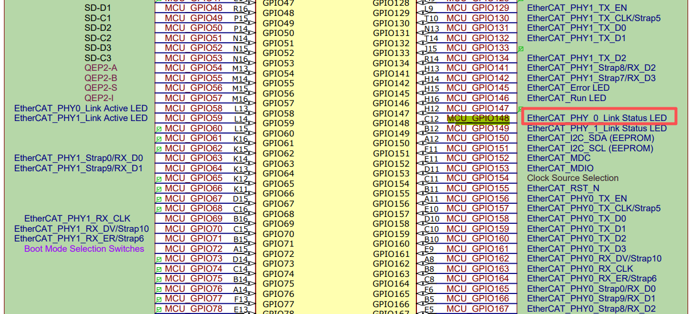
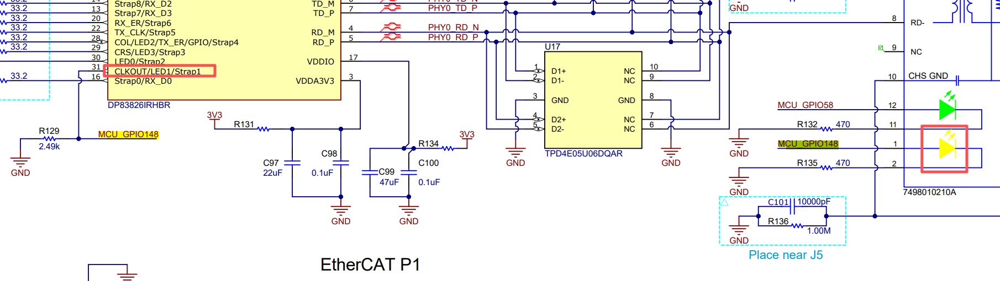

- 2、AM243x黄灯常亮(Link)，绿灯闪烁(Activity)

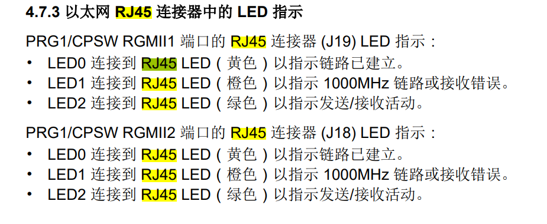

- 3、AM243x以太网多协议专用指示灯：

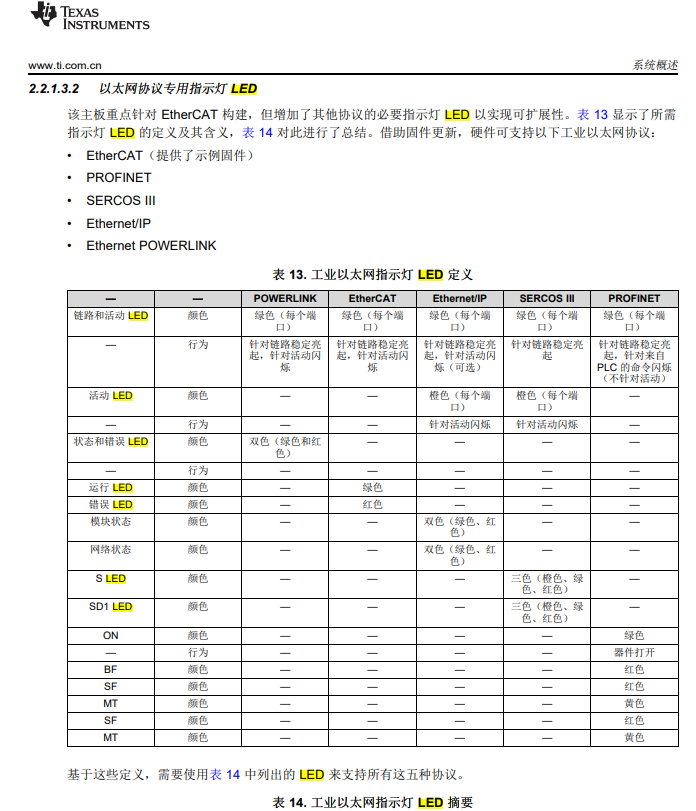

- 4、TMDX654IDKEVM黄灯闪烁(Activity)，绿灯常亮(Link)
https://www.ti.com.cn/lit/ug/spruim6a/spruim6a.pdf?ts=1757904582598

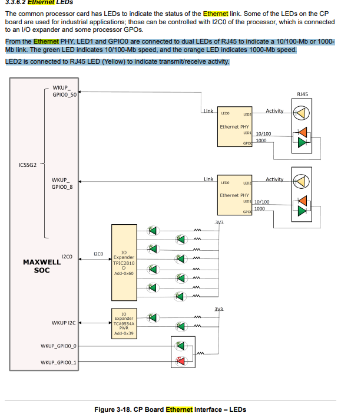

- 5、stm32h563没有phylink
https://www.st.com.cn/resource/en/schematic_pack/mb1404-h563zi-c01-schematic.pdf

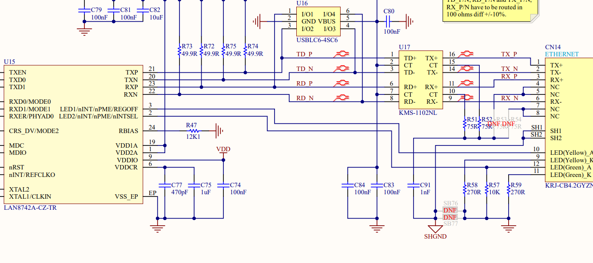

- 6、hpm6e80提到esc有phy link Activity等专用引脚，link也有极性
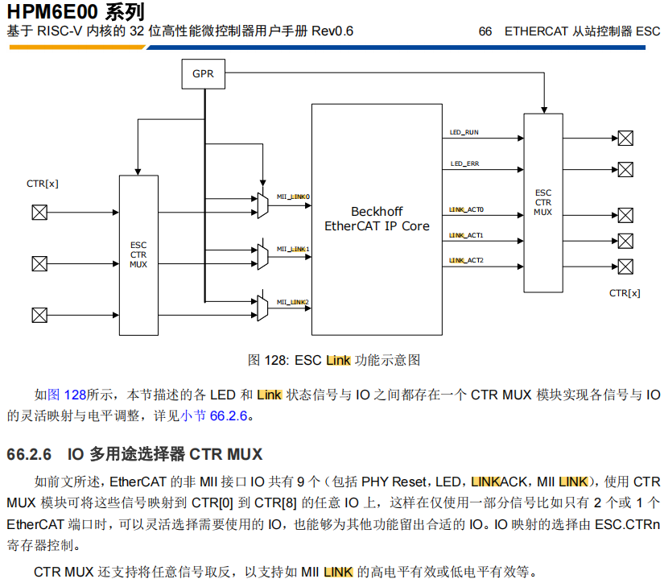

- 7、GD32H75E内置phy，但rj45似乎只有一个灯

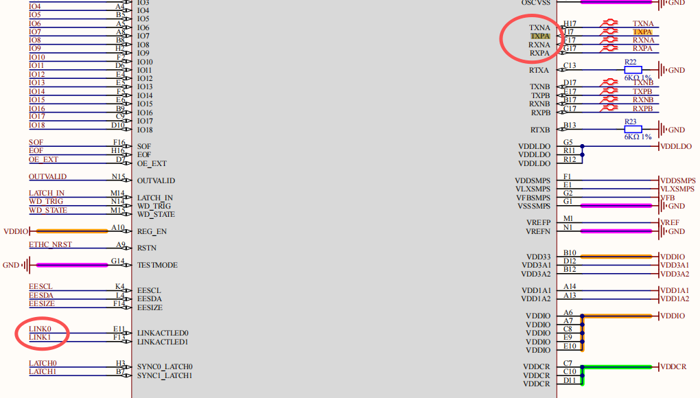
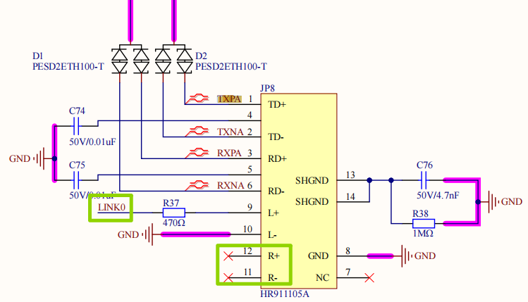

# 七、RJ45指示灯与ethercat指示灯
二者有重叠，但不是一回事。RJ45指示灯未有明确标准规定，ethercat指示灯beckoff有规定
- 1、ethercat指示灯beckoff有明确规定，并且esc有对应的引脚

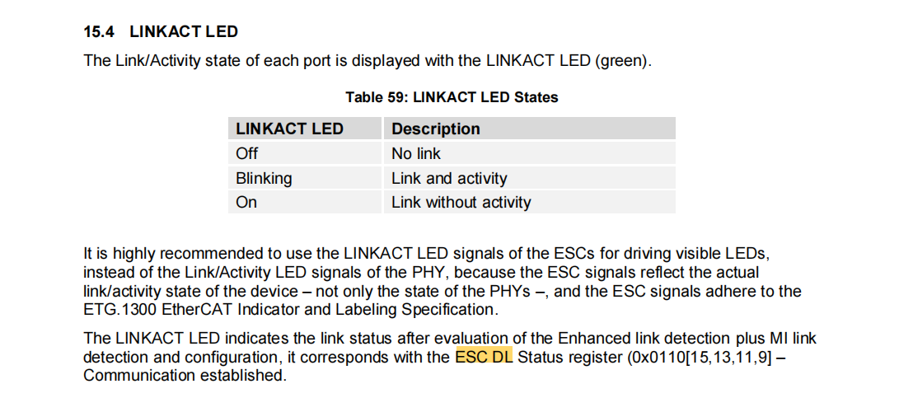
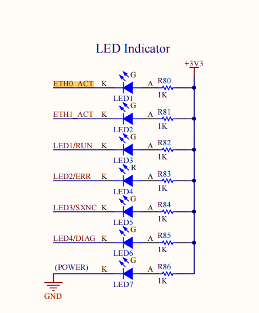
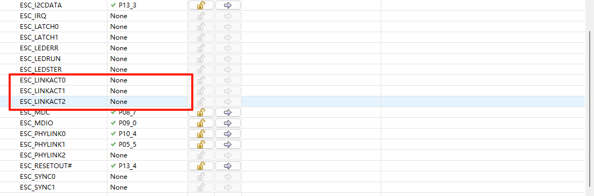

- 2、RJ45指示灯在交换机、电脑灯似乎有行业默认，但仍然要看说明书。一般来说，绿灯常亮表示连接Link，黄灯闪烁表示数据通讯Activity。

# 八、总结
1、RJ45黄绿灯似乎没有明确标准，推荐绿灯常亮表示连接Link，黄灯闪烁表示数据通讯Activity
2、phy芯片的硬件设计和软件配置均有影响
3、部分phy芯片的phy地址复用了LED0/1引脚
4、ethercat依赖esc的phylink引脚，所以多协议产品需优先考虑ethercat设计
5、**总结一条原则：优先link接RJ45绿灯**，然后phylink、LED引脚功能、phy地址

