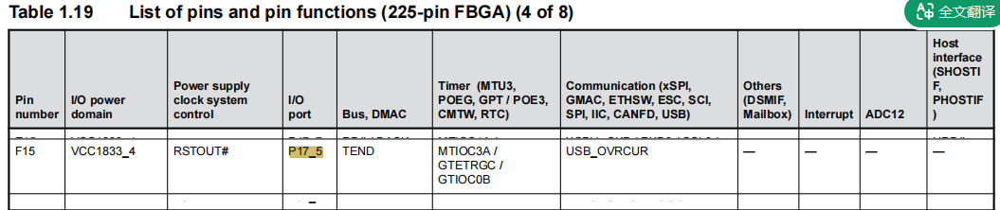
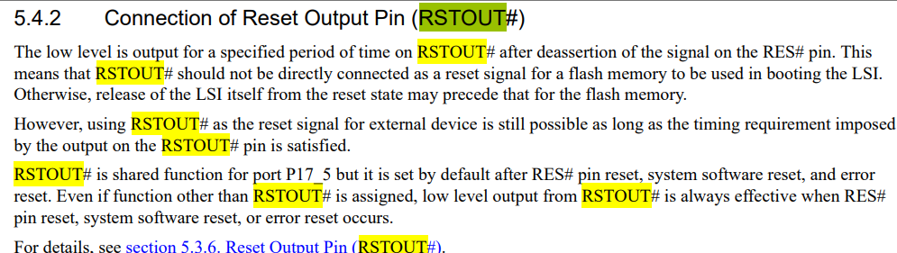
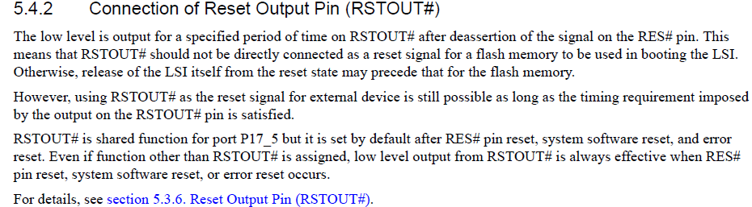
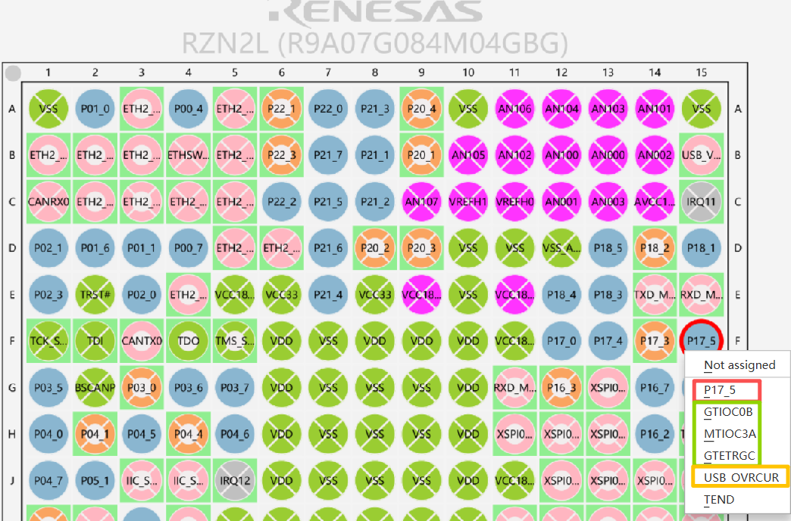
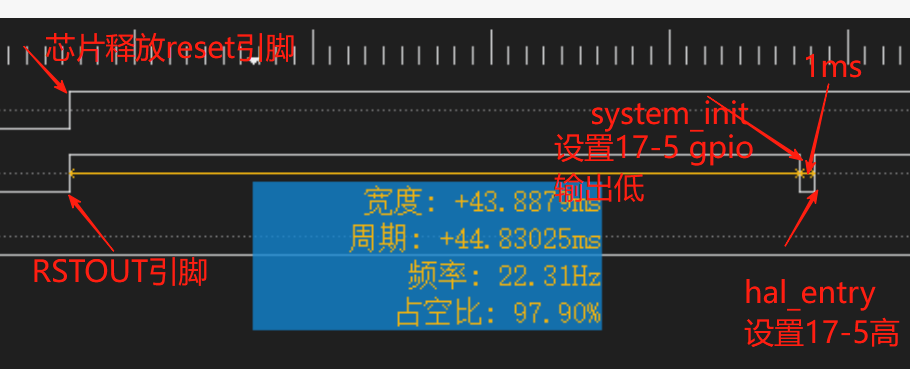
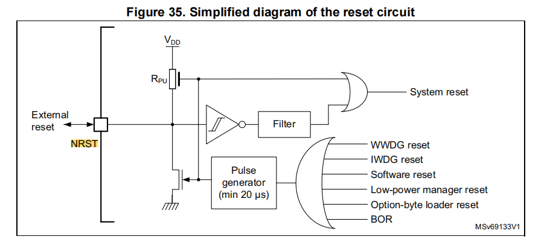
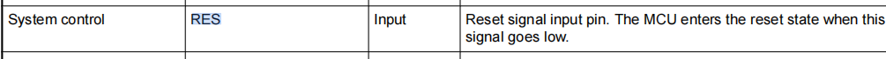
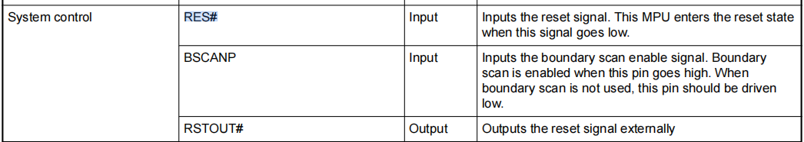
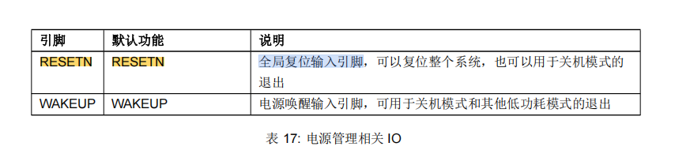

二十三、RZN2L P17_5/RSTOUT引脚使用注意事项
===
[toc]
# 一、目的/概述
1、RZN2L的P17_5是多功能复用引脚，但RSTOUT功能优先级高，作为GPIO输出功能需谨慎
2、知识扩展，横向对比其他芯片

# 二、资料来源
- 官方手册

# 三、RZN2L P17_5引脚功能介绍
## 3.1 基础功能
- RZN2L P17_5有GPIO、定时器输出、USB过流、DMA完成输出和RSTOUT#共5类功能

## 3.2 RSTOUT#复位输出功能

- 通过FSP配置界面可以看到RSTOUT#是无法设置的

- 复位输出功能在进入用户代码之生效
- 不推荐使用P17_5作为GPIO输出功能，会导致上电默认有一小段高电平输出

# 四、ST renesas HPM横向对比

|特征|STM32|瑞萨RARX|瑞萨RZRIN|HPM|
|:-:|:-:|:-:|:-:|:-:|
|复位引脚|NRST|RES#|RES# RSTOUT#|RESETN|
|方向|双向|输入|输入 输出 分离解耦|输入|
|外部复位输入|✓|✓|✓|✓|
|内部复位输出 复位信号|WWDG IWDG Software Low-power Option-byte loader BOR|-|RES# pin System software Error|-|
|推荐用法|阻容复位|阻容复位|阻容复位 非GPIO输出|阻容复位|

# 五、总结
- 不推荐使用P17_5作为GPIO输出功能
- 不同厂家芯片复位有各自特点