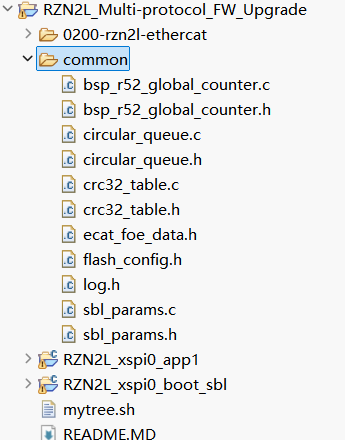
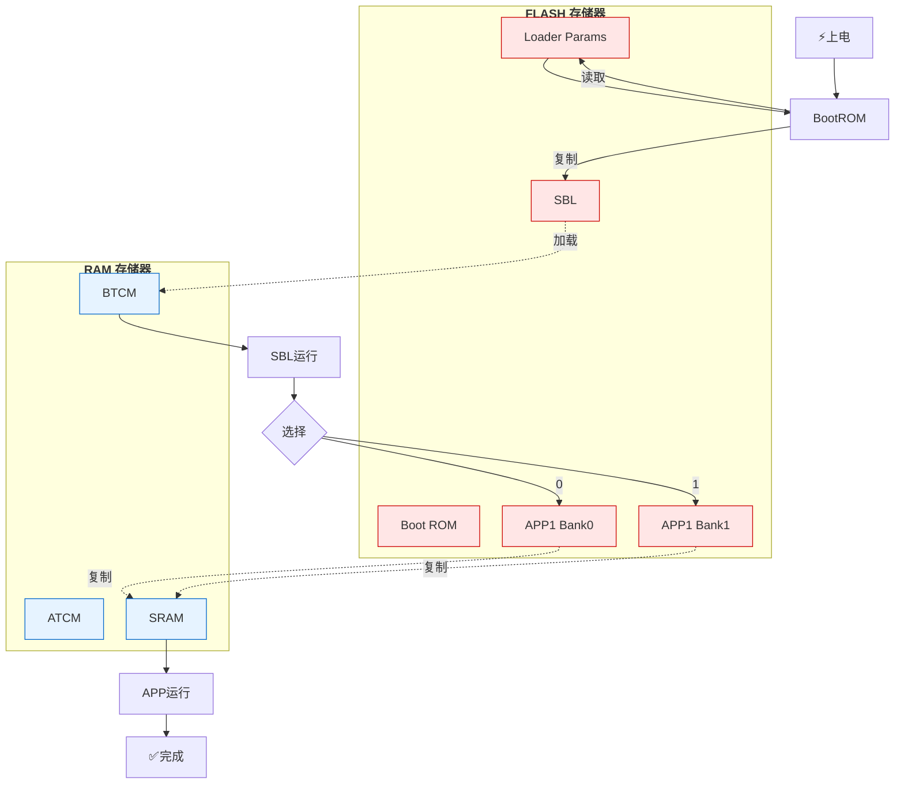

二十四、RZN2L多协议双BANK升级SDK V0.1
===
[toc]
# 一、目的/概述
1、设备部署后不便于通过USB、串口、Jlink、返厂等方式升级固件，ECAT选择FOE升级
2、FOE升级希望通过双BANK可以回滚上一个版本
3、硬件一致性、生产、维护等因素考虑多协议，也需要多协议切换和升级
4、官方相关文档大概5个，但一定程度无法兼容或统一，需要统一的SDK便于开发和维护
5、FOE FSP 1.3和FOE FSP 2.0以上存在差异，也可能存在无法启动的可能性
6、介绍RZN2L多协议双BANK升级SDK V0.1架构和测试

- GitHub仓库：
https://github.com/cl234583745/rzn2l_multi-protocol_fw_upgrade
https://gitee.com/292812832/rzn2l_multi-protocol_fw_upgrade

# 二、资料来源
- [r01an6471ej0300-rzt2-n2-flashboot.pdf](./doc/r01an6471ej0300-rzt2-n2-flashboot.pdf)
- [r01an6472ej0230-rzt2-n2-fwupdate.pdf](./doc/r01an6472ej0230-rzt2-n2-fwupdate.pdf)
- [r01an6737ej0210-rzn2l-separating-loader-and-application.pdf](./doc/r01an6737ej0210-rzn2l-separating-loader-and-application.pdf)
- [r01an7217ee0100-rzn2l-ethernet-protocol-auto-detection.pdf](./doc/r01an7217ee0100-rzn2l-ethernet-protocol-auto-detection.pdf)
- [r01an7423ej0200-rzn2l-ecat-cia402-foe.pdf](./doc/r01an7423ej0200-rzn2l-ecat-cia402-foe.pdf)

# 三、目录结构



<pre>
RZN2L_Multi-protocol_FW_Upgrade/
├── 0200-rzn2l-ethercat/ [HIDDEN]
├── <strong>common/
│   ├── bsp_r52_global_counter.c
│   ├── bsp_r52_global_counter.h
│   ├── circular_queue.c
│   ├── circular_queue.h
│   ├── crc32_table.c
│   ├── crc32_table.h
│   ├── ecat_foe_data.h
│   ├── flash_config.h
│   ├── log.h
│   ├── sbl_params.c
│   └── sbl_params.h</strong>
├── RZN2L_xspi0_app1/
│   ├── BANK0/
│   │   └── <strong>RZN2L_xspi0_app1_bank0_with_crc.bin</strong>
│   ├── BANK1/
│   │   └── <strong>RZN2L_xspi0_app1_bank1_with_crc.bin</strong>
│   ├── rzn/ [HIDDEN]
│   ├── rzn_cfg/ [HIDDEN]
│   ├── rzn_gen/ [HIDDEN]
│   ├── script/
│   │   ├── <strong>fsp_xspi0_boot_app1_bank0.ld</strong>
│   │   └── <strong>fsp_xspi0_boot_app1_bank1.ld</strong>
│   ├── src/
│   │   ├── ethercat/
│   │   │   ├── beckhoff/
│   │   │   │   └── Src/
│   │   │   │       ├── <strong>bootmode.c</strong>
│   │   │   │       ├── <strong>bootmode.h</strong>
│   │   │   │       ├── ecatfoe.c
│   │   │   │       ├── ecatfoe.h
│   │   │   │       ├── foeappl.c
│   │   │   │       ├── foeappl.h
│   │   │   └── renesas/
│   │   │       ├── samplefoe.c
│   │   │       ├── samplefoe.h
│   │   ├── r_fw_up_rz/ [HIDDEN]
│   │   ├── hal_entry.c
│   │   └── syscall.c
│   ├── <strong>attach_crc_bank0.py</strong>
│   ├── <strong>attach_crc_bank1.py</strong>
│   ├── configuration.xml
│   ├── RZN2L_xspi0_app1.sbd.backup0
│   ├── RZN2L_xspi0_app1.sbd.backup1
│   └── rzn_cfg.txt
├── RZN2L_xspi0_boot_sbl/
│   ├── rzn/ [HIDDEN]
│   ├── rzn_cfg/ [HIDDEN]
│   ├── rzn_gen/ [HIDDEN]
│   ├── script/
│   │   └── <strong>fsp_xspi0_boot_loader.ld</strong>
│   ├── src/
│   │   ├── <strong>APP1_BANK0_Flash_section.s</strong>
│   │   ├── <strong>APP1_BANK1_Flash_section.s</strong>
│   │   ├── hal_entry.c
│   │   ├── <strong>loader_table.c</strong>
│   │   ├── <strong>loader_table.h</strong>
│   │   └── syscall.c
│   ├── configuration.xml
│   ├── RZN2L_xspi0_boot_sbl.srec.backup
│   └── rzn_cfg.txt
├── mytree.sh
└── README.MD
<strong></strong>
<span style="color:red; font-weight:bold"></span>
</pre>

# 四、环境要求
- Window 10/11
- Renesas e² studio Version: 2025-07 (25.7.0)
- RZN FSP 2.0.0
- TwinCAT v3.1.4024.65
- Python 3.12.12
- CN032开发板(RZN2L+KSZ8081+w25q128)

# 五、Flash地址划分

```
FLASH MEMORY MAP (起始地址: 0x6000 0000)
═══════════════════════════════════════════════════════════
             SBL:   
0x6000 0000  ┌─────────────────────────────────────┐
             │ loader_param                        │ 0x4C
0x6000 004c  ├─────────────────────────────────────┤
             │ sbl code                            │ ~512KB
0x6008 0000  ├─────────────────────────────────────┤
             │ sbl LOADER_TABLE                    │ ~508KB
0x600F F000  ├─────────────────────────────────────┤
             │ sbl boot params                     │ 4KB
0x600F FFFF  └─────────────────────────────────────┘
             APP1BANK0：   
0x6010 0000  ┌─────────────────────────────────────┐
             │ .header                             │
             │  ├─ "APP1BANK0" (9B)                │
             │  ├─ app1bank0 length (4B)           │ 0x4C
             │  └─ reserved (0x4C-0x1C=0x30)       │
0x6010 004c  ├─────────────────────────────────────┤
             │ .identify (4x4B)                    │ 16B
0x6010 005c  ├─────────────────────────────────────┤
             │         app1 bank0 code             │
0x601F FFFC  ├─────────────────────────────────────┤
             │ 整区 CRC32 (0x6010_0000-0x6020_0000)│ 4B
0x601F FFFF  └─────────────────────────────────────┘
             APP1BANK1:
0x6020 0000  ┌─────────────────────────────────────┐
             │ .header                             │
             │  ├─ "APP1BANK1" (9B)                │
             │  ├─ app1bank1 length (4B)           │ 0x4C
             │  └─ reserved (0x4C-0x1C=0x30)       │
0x6020 004c  ├─────────────────────────────────────┤
             │ .identify (4x4B)                    │ 16B
0x6020 005c  ├─────────────────────────────────────┤
             │         app1 bank1 code             │
0x602F FFFC  ├─────────────────────────────────────┤
             │ 整区 CRC32 (0x6020_0000-0x6030_0000)│ 4B
0x602F FFFF  └─────────────────────────────────────┘

0x6030 0000  ┌─────────────────────────────────────┐
             │         剩余保留区域                 │
             └─────────────────────────────────────┘
```

# 六、启动流程图


# 七、测试日志
```
g_uart0.p_api->open
[INFO] date:Feb 12 2026
time:16:27:50
file:../src/hal_entry.c
func:hal_entry,line:132
hello world!
[INFO] PI=3.141593
[INFO] Built with RZ/N Flexible Software Package version 2.0.0
[INFO] BootBankParams check OK!!!
[INFO] Loader start! 0.1.0
*****
Ready to Jump to the app!

[INFO] ****************************
App start!
[INFO] App start! 0.1.0
[INFO] date:Feb 12 2026
time:16:27:30
file:../src/hal_entry.c
func:hal_entry,line:148
hello world!
[INFO] PI=3.141593
[INFO] Built with RZ/N Flexible Software Package version 2.0.0
[INFO] RZ/N2L EtherCAT sample program starts on BANK0.
[INFO] BL_Start State=3
[INFO] BootBankParams check OK!!!
[INFO] P:0% [INFO] P:0% [INFO] P:0% [INFO] P:0% [INFO] P:0% [INFO] P:1% [INFO] P:1% [INFO] P:1% [INFO] P:1% [INFO] P:1% [INFO] P:1% [INFO] P:1% [INFO] P:2% [INFO] P:2% [INFO] P:2% [INFO] P:2% [INFO] P:2% [INFO] P:2% [INFO] P:3% [INFO] P:3% [INFO] P:3% [INFO] P:3% [INFO] P:3% [INFO] P:3% [INFO] P:3% [INFO] P:4% [INFO] P:4% [INFO] P:4% [INFO] P:4% [INFO] P:4% [INFO] P:4% [INFO] P:4% [INFO] P:5% [INFO] P:5% [INFO] P:5% [INFO] P:5% [INFO] P:5% [INFO] P:5% [INFO] P:6% [INFO] P:6% [INFO] P:6% [INFO] P:6% [INFO] P:6% [INFO] P:6% [INFO] P:6% [INFO] P:7% [INFO] P:7% [INFO] P:7% [INFO] P:7% [INFO] P:7% [INFO] P:7% [INFO] P:8% [INFO] P:8% [INFO] P:8% [INFO] P:8% [INFO] P:8% [INFO] P:8% [INFO] P:8% [INFO] P:9% [INFO] P:9% [INFO] P:9% [INFO] P:9% [INFO] P:10% [INFO] P:10% [INFO] P:10% [INFO] P:10% [INFO] P:10% [INFO] P:10% [INFO] P:10% [INFO] P:11% [INFO] P:11% [INFO] P:11% [INFO] P:11% [INFO] P:11% [INFO] P:11% [INFO] P:11% [INFO] P:12% [INFO] P:12% [INFO] P:12% [INFO] P:12% [INFO] P:12% [INFO] P:12% [INFO] P:13% [INFO] P:13% [INFO] P:13% [INFO] P:13% [INFO] P:13% [INFO] P:13% [INFO] P:13% [INFO] P:14% [INFO] P:14% [INFO] P:14% [INFO] P:14% [INFO] P:14% [INFO] P:14% [INFO] P:14% [INFO] P:15% [INFO] P:15% [INFO] P:15% [INFO] P:15% [INFO] P:15% [INFO] P:15% [INFO] P:16% [INFO] P:16% [INFO] P:16% [INFO] P:16% [INFO] P:16% [INFO] P:16% [INFO] P:16% [INFO] P:17% [INFO] P:17% [INFO] P:17% [INFO] P:17% [INFO] P:17% [INFO] P:17% [INFO] P:18% [INFO] P:18% [INFO] P:18% [INFO] P:18% [INFO] P:18% [INFO] P:19% [INFO] P:19% [INFO] P:19% [INFO] P:19% [INFO] P:19% [INFO] P:19% [INFO] P:20% [INFO] P:20% [INFO] P:20% [INFO] P:20% [INFO] P:20% [INFO] P:20% [INFO] P:20% [INFO] P:21% [INFO] P:21% [INFO] P:21% [INFO] P:21% [INFO] P:21% [INFO] P:21% [INFO] P:21% [INFO] P:22% [INFO] P:22% [INFO] P:22% [INFO] P:22% [INFO] P:22% [INFO] P:22% [INFO] P:23% [INFO] P:23% [INFO] P:23% [INFO] P:23% [INFO] P:23% [INFO] P:23% [INFO] P:23% [INFO] P:24% [INFO] P:24% [INFO] P:24% [INFO] P:24% [INFO] P:24% [INFO] P:24% [INFO] P:24% [INFO] P:25% [INFO] P:25% [INFO] P:25% [INFO] P:25% [INFO] P:25% [INFO] P:25% [INFO] P:26% [INFO] P:26% [INFO] P:26% [INFO] P:26% [INFO] P:26% [INFO] P:26% [INFO] P:26% [INFO] P:27% [INFO] P:27% [INFO] P:27% [INFO] P:27% [INFO] P:28% [INFO] P:28% [INFO] P:28% [INFO] P:28% [INFO] P:28% [INFO] P:28% [INFO] P:28% [INFO] P:29% [INFO] P:29% [INFO] P:29% [INFO] P:29% [INFO] P:29% [INFO] P:29% [INFO] P:30% [INFO] P:30% [INFO] P:30% [INFO] P:30% [INFO] P:30% [INFO] P:30% [INFO] P:30% [INFO] P:31% [INFO] P:31% [INFO] P:31% [INFO] P:31% [INFO] P:31% [INFO] P:31% [INFO] P:31% [INFO] P:32% [INFO] P:32% [INFO] P:32% [INFO] P:32% [INFO] P:32% [INFO] P:32% [INFO] P:33% [INFO] P:33% [INFO] P:33% [INFO] P:33% [INFO] P:33% [INFO] P:33% [INFO] P:33% [INFO] P:34% [INFO] P:34% [INFO] P:34% [INFO] P:34% [INFO] P:34% [INFO] P:34% [INFO] P:34% [INFO] P:35% [INFO] P:35% [INFO] P:35% [INFO] P:35% [INFO] P:35% [INFO] P:35% [INFO] P:36% [INFO] P:36% [INFO] P:36% [INFO] P:36% [INFO] P:36% [INFO] P:37% [INFO] P:37% [INFO] P:37% [INFO] P:37% [INFO] P:37% [INFO] P:37% [INFO] P:38% [INFO] P:38% [INFO] P:38% [INFO] P:38% [INFO] P:38% [INFO] P:38% [INFO] P:38% [INFO] P:39% [INFO] P:39% [INFO] P:39% [INFO] P:39% [INFO] P:39% [INFO] P:39% [INFO] P:40% [INFO] P:40% [INFO] P:40% [INFO] P:40% [INFO] P:40% [INFO] P:40% [INFO] P:40% [INFO] P:41% [INFO] P:41% [INFO] P:41% [INFO] P:41% [INFO] P:41% [INFO] P:41% [INFO] P:41% [INFO] P:42% [INFO] P:42% [INFO] P:42% [INFO] P:42% [INFO] P:42% [INFO] P:42% [INFO] P:43% [INFO] P:43% [INFO] P:43% [INFO] P:43% [INFO] P:43% [INFO] P:43% [INFO] P:43% [INFO] P:44% [INFO] P:44% [INFO] P:44% [INFO] P:44% [INFO] P:44% [INFO] P:44% [INFO] P:44% [INFO] P:45% [INFO] P:45% [INFO] P:45% [INFO] P:45% [INFO] P:46% [INFO] P:46% [INFO] P:46% [INFO] P:46% [INFO] P:46% [INFO] P:46% [INFO] P:46% [INFO] P:47% [INFO] P:47% [INFO] P:47% [INFO] P:47% [INFO] P:47% [INFO] P:47% [INFO] P:48% [INFO] P:48% [INFO] P:48% [INFO] P:48% [INFO] P:48% [INFO] P:48% [INFO] P:48% [INFO] P:49% [INFO] P:49% [INFO] P:49% [INFO] P:49% [INFO] P:49% [INFO] P:49% [INFO] P:50% [INFO] P:50% [INFO] P:50% [INFO] P:50% [INFO] P:50% [INFO] P:50% [INFO] P:50% [INFO] P:51% [INFO] P:51% [INFO] P:51% [INFO] P:51% [INFO] P:51% [INFO] P:51% [INFO] P:51% [INFO] P:52% [INFO] P:52% [INFO] P:52% [INFO] P:52% [INFO] P:52% [INFO] P:52% [INFO] P:53% [INFO] P:53% [INFO] P:53% [INFO] P:53% [INFO] P:53% [INFO] P:53% [INFO] P:53% [INFO] P:54% [INFO] P:54% [INFO] P:54% [INFO] P:54% [INFO] P:55% [INFO] P:55% [INFO] P:55% [INFO] P:55% [INFO] P:55% [INFO] P:55% [INFO] P:55% [INFO] P:56% [INFO] P:56% [INFO] P:56% [INFO] P:56% [INFO] P:56% [INFO] P:56% [INFO] P:56% [INFO] P:57% [INFO] P:57% [INFO] P:57% [INFO] P:57% [INFO] P:57% [INFO] P:57% [INFO] P:58% [INFO] P:58% [INFO] P:58% [INFO] P:58% [INFO] P:58% [INFO] P:58% [INFO] P:58% [INFO] P:59% [INFO] P:59% [INFO] P:59% [INFO] P:59% [INFO] P:59% [INFO] P:59% [INFO] P:60% [INFO] P:60% [INFO] P:60% [INFO] P:60% [INFO] P:60% [INFO] P:60% [INFO] P:60% [INFO] P:61% [INFO] P:61% [INFO] P:61% [INFO] P:61% [INFO] P:61% [INFO] P:61% [INFO] P:61% [INFO] P:62% [INFO] P:62% [INFO] P:62% [INFO] P:62% [INFO] P:62% [INFO] P:62% [INFO] P:63% [INFO] P:63% [INFO] P:63% [INFO] P:63% [INFO] P:63% [INFO] P:64% [INFO] P:64% [INFO] P:64% [INFO] P:64% [INFO] P:64% [INFO] P:64% [INFO] P:65% [INFO] P:65% [INFO] P:65% [INFO] P:65% [INFO] P:65% [INFO] P:65% [INFO] P:65% [INFO] P:66% [INFO] P:66% [INFO] P:66% [INFO] P:66% [INFO] P:66% [INFO] P:66% [INFO] P:66% [INFO] P:67% [INFO] P:67% [INFO] P:67% [INFO] P:67% [INFO] P:67% [INFO] P:67% [INFO] P:68% [INFO] P:68% [INFO] P:68% [INFO] P:68% [INFO] P:68% [INFO] P:68% [INFO] P:68% [INFO] P:69% [INFO] P:69% [INFO] P:69% [INFO] P:69% [INFO] P:69% [INFO] P:69% [INFO] P:70% [INFO] P:70% [INFO] P:70% [INFO] P:70% [INFO] P:70% [INFO] P:70% [INFO] P:70% [INFO] P:71% [INFO] P:71% [INFO] P:71% [INFO] P:71% [INFO] P:71% [INFO] P:71% [INFO] P:71% [INFO] P:72% [INFO] P:72% [INFO] P:72% [INFO] P:72% [INFO] P:73% [INFO] P:73% [INFO] P:73% [INFO] P:73% [INFO] P:73% [INFO] P:73% [INFO] P:73% [INFO] P:74% [INFO] P:74% [INFO] P:74% [INFO] P:74% [INFO] P:74% [INFO] P:74% [INFO] P:75% [INFO] P:75% [INFO] P:75% [INFO] P:75% [INFO] P:75% [INFO] P:75% [INFO] P:75% [INFO] P:76% [INFO] P:76% [INFO] P:76% [INFO] P:76% [INFO] P:76% [INFO] P:76% [INFO] P:76% [INFO] P:77% [INFO] P:77% [INFO] P:77% [INFO] P:77% [INFO] P:77% [INFO] P:77% [INFO] P:78% [INFO] P:78% [INFO] P:78% [INFO] P:78% [INFO] P:78% [INFO] P:78% [INFO] P:78% [INFO] P:79% [INFO] P:79% [INFO] P:79% [INFO] P:79% [INFO] P:79% [INFO] P:79% [INFO] P:80% [INFO] P:80% [INFO] P:80% [INFO] P:80% [INFO] P:80% [INFO] P:80% [INFO] P:80% [INFO] P:81% [INFO] P:81% [INFO] P:81% [INFO] P:81% [INFO] P:81% [INFO] P:82% [INFO] P:82% [INFO] P:82% [INFO] P:82% [INFO] P:82% [INFO] P:82% [INFO] P:83% [INFO] P:83% [INFO] P:83% [INFO] P:83% [INFO] P:83% [INFO] P:83% [INFO] P:83% [INFO] P:84% [INFO] P:84% [INFO] P:84% [INFO] P:84% [INFO] P:84% [INFO] P:84% [INFO] P:85% [INFO] P:85% [INFO] P:85% [INFO] P:85% [INFO] P:85% [INFO] P:85% [INFO] P:85% [INFO] P:86% [INFO] P:86% [INFO] P:86% [INFO] P:86% [INFO] P:86% [INFO] P:86% [INFO] P:86% [INFO] P:87% [INFO] P:87% [INFO] P:87% [INFO] P:87% [INFO] P:87% [INFO] P:87% [INFO] P:88% [INFO] P:88% [INFO] P:88% [INFO] P:88% [INFO] P:88% [INFO] P:88% [INFO] P:88% [INFO] P:89% [INFO] P:89% [INFO] P:89% [INFO] P:89% [INFO] P:89% [INFO] P:89% [INFO] P:90% [INFO] P:90% [INFO] P:90% [INFO] P:90% [INFO] P:90% [INFO] P:91% [INFO] P:91% [INFO] P:91% [INFO] P:91% [INFO] P:91% [INFO] P:91% [INFO] P:91% [INFO] P:92% [INFO] P:92% [INFO] P:92% [INFO] P:92% [INFO] P:92% [INFO] P:92% [INFO] P:93% [INFO] P:93% [INFO] P:93% [INFO] P:93% [INFO] P:93% [INFO] P:93% [INFO] P:93% [INFO] P:94% [INFO] P:94% [INFO] P:94% [INFO] P:94% [INFO] P:94% [INFO] P:94% [INFO] P:95% [INFO] P:95% [INFO] P:95% [INFO] P:95% [INFO] P:95% [INFO] P:95% [INFO] P:95% [INFO] P:96% [INFO] P:96% [INFO] P:96% [INFO] P:96% [INFO] P:96% [INFO] P:96% [INFO] P:96% [INFO] P:97% [INFO] P:97% [INFO] P:97% [INFO] P:97% [INFO] P:97% [INFO] P:97% [INFO] P:98% [INFO] P:98% [INFO] P:98% [INFO] P:98% [INFO] P:98% [INFO] P:98% [INFO] P:98% [INFO] P:99% [INFO] P:99% [INFO] P:99% [INFO] P:99% [INFO] Last P:100%
[INFO] write flash finished!!!
[INFO] Flash crc check succeed!!!
[INFO] BL_DATA_STATUS_SII_UPDATE Buffer.word[SII_EEP_REVESIONNO]=300
[INFO] ECAT FOE Total Time:5000ms!!!

[INFO] BL_Stopg_uart0.p_api->open
[INFO] date:Feb 12 2026
time:16:27:50
file:../src/hal_entry.c
func:hal_entry,line:132
hello world!
[INFO] PI=3.141593
[INFO] Built with RZ/N Flexible Software Package version 2.0.0
[INFO] BootBankParams check OK!!!
[INFO] Loader start! 0.1.0
*****
Ready to Jump to the app!

[INFO] ****************************
App start!
[INFO] App start! 0.1.0
[INFO] date:Feb 12 2026
time:16:27:30
file:../src/hal_entry.c
func:hal_entry,line:148
hello world!
[INFO] PI=3.141593
[INFO] Built with RZ/N Flexible Software Package version 2.0.0
[INFO] RZ/N2L EtherCAT sample program starts on BANK0.
```

# 八、已知问题或不足
- FOE测试可升级，但未完成双BANK切换
- 只支持e2studo
- 暂不支持其他协议
- SBL暂不支持RTOS、LWIP
- 仅仅可测试验证，无法保证稳定性
- 暂不支持RZ其他芯片

# 九、总结
- 参考了官方5个文档，该SDK理论支持RZN2L多协议双BANK升级SDK(V0.1)
- 通过构建后指令、Python等指令或工具，尽量做到自动化
- 年前发布V0.1，根据大家反馈情况，再决定是否继续维护

