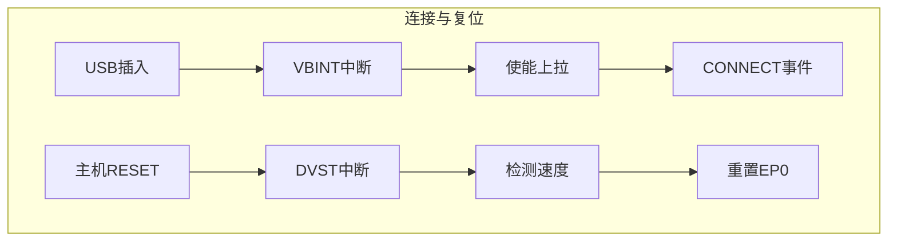
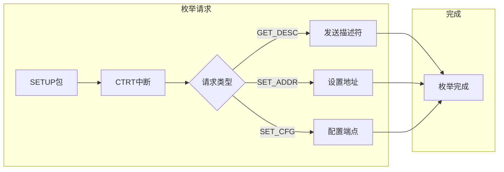
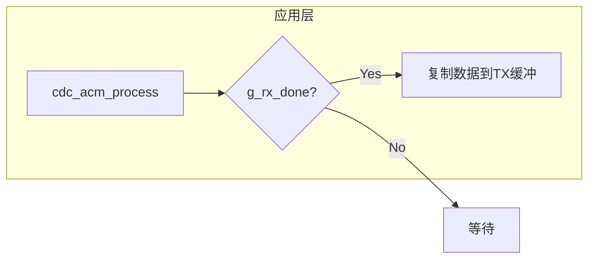
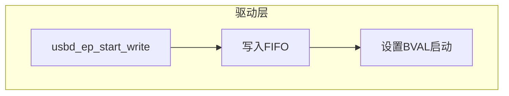
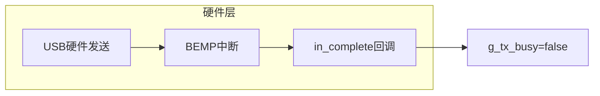
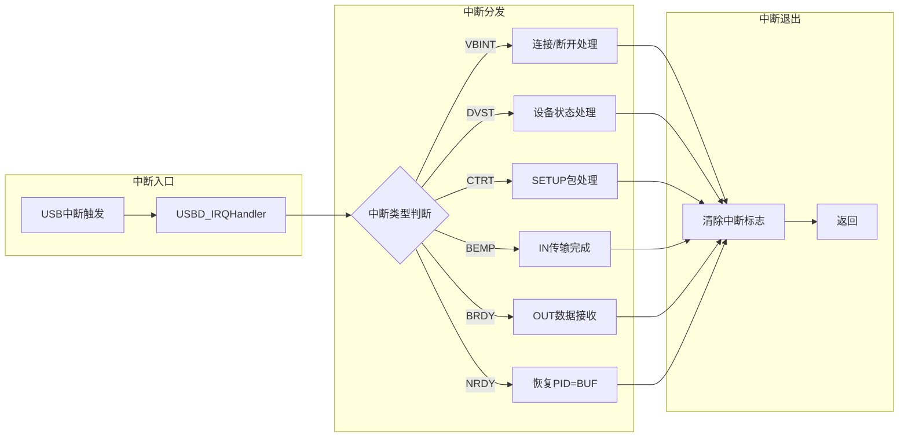
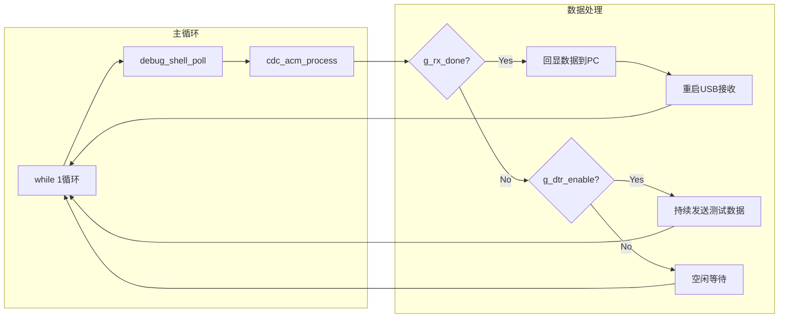

二十七、RZN2L CherryUSB移植与性能对比
===
[toc]

# 一、目的/概述

1、cherryusb还没有人支持瑞萨芯片，我们尝试在RZN2L CR52上移植CherryUSB协议栈

2、在rzn2l芯片上实现USB CDC ACM 功能(实现cherryusb hal)

3、对比CherryUSB与瑞萨原厂USB例程的性能差异

4、验证全速（12Mbps）和高速（480Mbps）模式下的传输性能

# 二、CherryUSB简介

## 2.1 什么是CherryUSB？

CherryUSB是一个轻量级的USB主机和设备协议栈，具有以下特点：

| 特性 | 说明 |
|------|------|
| 代码量小 | 核心代码约10KB，适合资源受限的MCU |
| 移植简单 | 统一的HAL抽象层，只需实现几个底层函数 |
| 性能优秀 | 优化的数据传输路径，支持DMA |
| 功能完整 | 支持USB Host/Device，包含常见USB类 |
| 社区活跃 | 持续更新维护，文档齐全 |

## 2.2 相关资源

| 资源 | 链接 |
|------|------|
| 官方仓库 | https://github.com/cherry-embedded/CherryUSB |
| 官方文档 | https://cherryusb.readthedocs.io/ |
| 示例代码 | https://github.com/cherry-embedded/CherryUSB/tree/master/demo |
| 移植指南 | https://cherryusb.readthedocs.io/zh-cn/latest/quick_start/transplant.html |

# 三、移植涉及的文件

## 3.1 CherryUSB核心文件

从CherryUSB官方仓库复制以下文件到工程：

```
cherryusb_port/
├── cherryusb/                    # CherryUSB核心库
│   ├── core/                     # USB核心协议
│   │   └── usbd_core.c           # USB设备核心
│   ├── class/                    # USB类实现
│   │   └── cdc/                  # CDC类
│   ├── common/                   # 公共定义
│   ├── osal/                     # OS抽象层
│   │   └── usb_osal_none.c       # 无OS适配
│   └── usb_config.h              # USB配置
├── config/                       # 配置文件
│   └── cherryusb_config.h        # CherryUSB配置
├── examples/                     # 示例代码
│   ├── cdc_acm_descriptor.c      # CDC描述符
│   ├── cdc_acm_descriptor.h
│   ├── cdc_acm_example.c         # CDC示例
│   └── cdc_acm_example.h
└── hal/                          # 硬件抽象层
    ├── usb_dc_rzn2l.c            # RZN2L USB设备驱动
    ├── usb_dc_rzn2l.h
    ├── usb_interrupt_override.c  # 中断处理
    ├── usb_interrupt_override.h
    └── usb_reg_rzn2l.h           # 寄存器定义
```

## 3.2 HAL层移植文件

移植CherryUSB需要实现以下HAL层函数：

| 文件 | 功能 |
|------|------|
| `usb_dc_rzn2l.c` | USB设备控制器驱动，实现初始化、端点配置、数据收发 |
| `usb_dc_rzn2l.h` | 驱动头文件，定义数据结构和函数接口 |
| `usb_interrupt_override.c` | USB中断处理，覆盖默认中断处理 |
| `usb_reg_rzn2l.h` | RZN2L USB寄存器定义 |

## 3.3 应用层文件

| 文件 | 功能 |
|------|------|
| `hal_entry.c` | 主入口，初始化USB并调用CDC示例 |
| `cdc_acm_example.c` | CDC ACM示例，实现回显和速度测试 |
| `cdc_acm_descriptor.c` | USB描述符定义 |
| `debug_shell.c` | 调试命令行 |

## 3.4 工程配置文件

| 文件 | 说明 |
|------|------|
| `script/fsp_xspi0_boot.ld` | 链接脚本 |
| `.cproject` | e2studio工程配置 |
| `rzn_gen/hal_data.c` | FSP硬件配置 |

# 四、软件流程

## 4.1 USB初始化流程


## 4.2 USB枚举流程






## 4.3 CDC数据传输流程

### 4.3.1 接收流程（OUT方向）


### 4.3.2 发送流程（IN方向）





## 4.4 中断处理流程



## 4.5 主循环流程



# 五、测试方法

## 5.1 测试环境

| 项目 | 配置 |
|------|------|
| MCU | Renesas RZN2L |
| 内核 | Cortex-R52 @ 400MHz |
| 编译器 | ARM GCC 13.3.1 |
| IDE | e2studio |
| USB模式 | Device（CDC ACM） |
| 测试工具 | Python + pyserial |

## 5.2 测试脚本

使用Python脚本 `test_cdc_speed.py` 进行速度测试：

```python
# 测试原理：
# OUT测试：主机写入10MB数据到设备，计算速度
# IN测试：设置DTR=1，设备循环发送数据，主机读取10MB，计算速度

import serial
import time
import sys

test_comx = sys.argv[1]  # COM端口号
test_maxsize = 10 * 1024 * 1024  # 10MB
test_data = b'\xAA' * 4096

# OUT测试
def test_cdc_out():
    send_count = 0
    begin = time.time()
    while send_count < test_maxsize:
        txdatalen = test_serial.write(test_data)
        send_count += txdatalen
    elapsed = time.time() - begin
    speed_mbps = (send_count / 1024 / 1024) / elapsed
    print("cdc out speed %.3f MB/s" % speed_mbps)

# IN测试
def test_cdc_in():
    read_count = 0
    begin = time.time()
    while read_count < test_maxsize:
        data = test_serial.read(test_maxsize)
        read_count += len(data)
    elapsed = time.time() - begin
    speed_mbps = (read_count / 1024 / 1024) / elapsed
    print("cdc in speed %.3f MB/s" % speed_mbps)
```

## 5.3 测试步骤

1、编译烧录固件到RZN2L开发板

2、连接USB线到PC，确认设备枚举成功

3、记录COM端口号（如COM11）

4、运行测试脚本：

```bash
python test_cdc_speed.py COM11
```

5、记录OUT和IN速度

# 六、性能测试结果

## 6.1 CherryUSB性能

### 全速模式（Full-Speed 12 Mbps）

```
=== USB CDC ACM ===
  Module:  USB_IP0
  Mode:    Peripheral
  Speed:   Full-Speed (12 Mbps)
  EP IN:   0x81 max=64
  EP OUT:  0x02 max=64
  Buffer:  RX=2048 TX=2048

测试结果：
cdc out speed 0.887 MB/s (10485760 B / 11.273 s)
cdc in speed 0.902 MB/s (10526720 B / 11.134 s)
```

### 高速模式（High-Speed 480 Mbps）

```
=== USB CDC ACM ===
  Module:  USB_IP0
  Mode:    Peripheral
  Speed:   High-Speed (480 Mbps)
  EP IN:   0x81 max=512
  EP OUT:  0x02 max=512
  Buffer:  RX=16384 TX=16384

测试结果：
cdc out speed 25.564 MB/s (10485760 B / 0.391 s)
cdc in speed 14.797 MB/s (10526720 B / 0.676 s)
```

## 6.2 瑞萨原厂例程性能

### 全速模式（Full-Speed 12 Mbps）

```
[USB] Module: USB_IP0
[USB] Mode: Peripheral
[USB] Speed: Low-Speed
[USB] DMA: OFF
[USB] BENCH_BUF_SIZE: 4096

测试结果：
OUT: 0.16 MB/s (10485760 B in 61620 ms)
IN:  0.89 MB/s (10485760 B in 11175 ms)
```

### 高速模式（High-Speed 480 Mbps）

```
[USB] Module: USB_IP0
[USB] Mode: Peripheral
[USB] Speed: High-Speed
[USB] DMA: OFF
[USB] BENCH_BUF_SIZE: 4096

测试结果：
OUT: 5.84 MB/s (10485760 B in 1712 ms)
IN:  19.65 MB/s (10485760 B in 509 ms)
```

## 6.3 性能对比

### 全速模式对比（Full-Speed 12 Mbps）

| 方向 | CherryUSB | 瑞萨原厂 | 对比 |
|------|-----------|----------|------|
| OUT (主机→设备) | 0.887 MB/s | 0.16 MB/s | **CherryUSB快5.5倍** |
| IN (设备→主机) | 0.902 MB/s | 0.89 MB/s | 基本持平 |

### 高速模式对比（High-Speed 480 Mbps）

| 方向 | CherryUSB | 瑞萨原厂 | 对比 |
|------|-----------|----------|------|
| OUT (主机→设备) | 25.564 MB/s | 8.25 MB/s | **CherryUSB快3.1倍** |
| IN (设备→主机) | 14.797 MB/s | 19.36 MB/s | 瑞萨快1.3倍 |

**性能分析：**

- **全速模式**：OUT方向CherryUSB大幅领先（5.5倍），IN方向基本持平
- **高速模式**：OUT方向CherryUSB领先3.1倍，IN方向瑞萨原厂略优
- **整体表现**：CherryUSB在OUT方向（主机发送到设备）性能优势明显

# 七、移植要点

## 7.1 关键配置

`cherryusb_config.h`中的关键配置：

```c
#define USBD_IRQHandler               USB_interrupt_override_IRQHandler
#define USBD_BASE                     R_USBF_BASE
#define CONFIG_USBDEV_EP_NUM          10
#define CONFIG_USBDEV_RX_BUFSIZE      2048
#define CONFIG_USBDEV_TX_BUFSIZE      2048
```

## 7.2 中断处理

RZN2L的USB中断需要特殊处理，通过`usb_interrupt_override.c`覆盖默认中断：

```c
void usb_interrupt_init(void) {
    // 配置GIC中断
    R_BSP_IrqCfgEnable(USB_INT_IRQn, 3, NULL);
}

void USB_interrupt_override_IRQHandler(void) {
    extern void USBD_IRQHandler(uint8_t busid);
    USBD_IRQHandler(0);
}
```

## 7.3 描述符配置

CDC ACM描述符需要根据实际需求配置：

```c
// 端点配置
#define CDC_IN_EP       0x81
#define CDC_OUT_EP      0x02
#define CDC_INT_EP      0x83

// 全速端点大小
#define CDC_MAX_MPS_FS  64
// 高速端点大小
#define CDC_MAX_MPS_HS  512
```

# 八、总结

| 项目 | 说明 |
|------|------|
| 移植难度 | 中等，需实现HAL层和中断处理 |
| 代码量 | 约20KB（含CDC类） |
| 全速性能 | OUT 0.887 MB/s, IN 0.902 MB/s |
| 高速性能 | OUT 25.564 MB/s, IN 14.797 MB/s |
| 优势 | OUT方向性能优秀，代码轻量，移植简单 |
| 适用场景 | 需要高性能USB传输的嵌入式应用 |

**核心要点：**

1、CherryUSB移植主要工作在HAL层，需实现`usb_dc_rzn2l.c`中的底层驱动

2、中断处理需要特殊覆盖，确保USB中断正确触发

3、高速模式下性能显著优于全速，建议优先使用高速模式

4、OUT方向性能提升明显，适合大量数据接收场景

# 九、附录

## 测试环境

- **MCU**：Renesas RZN2L
- **内核**：Cortex-R52 @ 400MHz
- **编译器**：ARM GCC 13.3.1
- **IDE**：e2studio
- **USB连接**：USB Type-C
- **测试数据量**：10MB

## 文件结构

```
27_rzn2l_cherryusb_port/
├── rzn2l_cherryusb_port/          # CherryUSB移植工程
│   ├── cherryusb_port/            # CherryUSB库和移植文件
│   ├── src/                       # 应用代码
│   ├── rzn_gen/                   # FSP生成的配置
│   ├── script/                    # 链接脚本
│   └── tools/                     # 测试工具
└── RZN2L_RSK_usb_pcdc/            # 瑞萨原厂例程（对比用）
    ├── src/                       # 应用代码
    ├── rzn/                       # FSP库
    └── tools/                     # 测试工具
```

## 相关链接

| 资源 | 说明 |
|------|------|
| CherryUSB仓库 | https://github.com/cherry-embedded/CherryUSB |
| RZN2L产品页 | https://www.renesas.cn/zh/products/rz-n2l |
| FSP文档 | https://github.com/renesas/rzn-fsp/releases/tag/v2.0.0 |