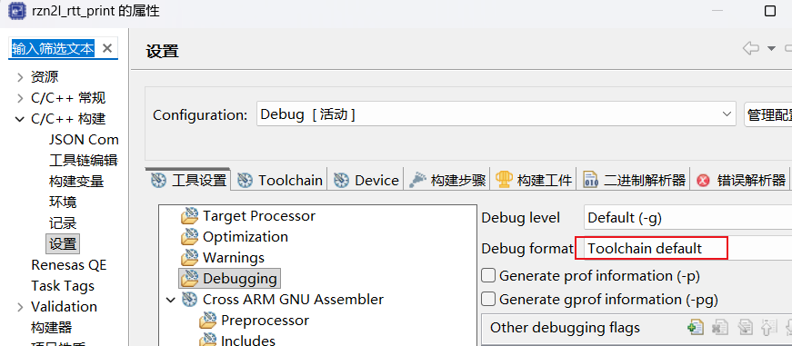
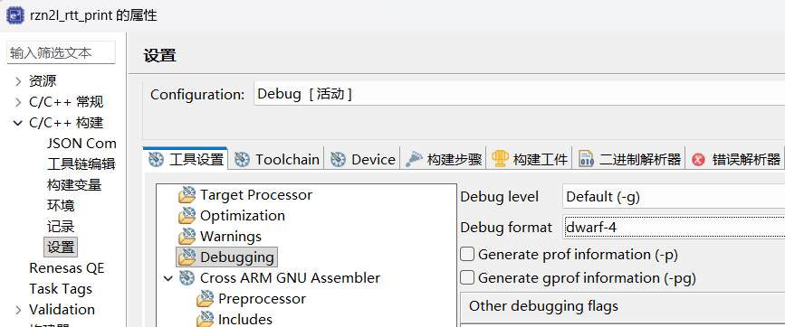

二十八、RZN2L GCC 13.3调试断点位置异常问题分析
===
[toc]

# 一、问题现象

使用GCC 13.3编译器调试RZN2L程序时，发现断点位置异常：

| ELF文件 | DWARF版本 | 调试状态 |
|---------|-----------|----------|
| `rzn2l_rtt_print - dwarf4.elf` | DWARF-4 | ✅ 断点正常 |
| `rzn2l_rtt_print - gcc13.3 default.elf` | DWARF-5 | ❌ 断点乱套 |

**关键现象**：同一个工程、同一份代码，仅改变调试信息格式，断点行为完全不同。

# 二、验证方法

## 2.1 检查ELF文件DWARF版本

使用`arm-none-eabi-readelf`工具验证：

```bash
# 检查dwarf4.elf
arm-none-eabi-readelf --debug-dump=info "rzn2l_rtt_print - dwarf4.elf" | Select-String "Version:"
# 输出: Version: 4

# 检查default.elf  
arm-none-eabi-readelf --debug-dump=info "rzn2l_rtt_print - gcc13.3 default.elf" | Select-String "Version:"
# 输出: Version: 5
```

## 2.2 检查编译选项差异

```bash
# dwarf4.elf编译选项（从ELF中提取）
GNU C99 13.3.1 20240614 -mcpu=cortex-r52 -mthumb -g -gdwarf-4 -Og

# default.elf编译选项
GNU C99 13.3.1 20240614 -mcpu=cortex-r52 -mthumb -g -Og
```

**差异**：dwarf4.elf显式指定了`-gdwarf-4`，default.elf使用默认格式。

# 三、根本原因分析

## 3.1 GCC 13.3默认调试格式

GCC各版本默认DWARF格式：

| GCC版本 | 默认DWARF格式 |
|---------|---------------|
| GCC 4.x | DWARF-2 |
| GCC 5.x - 9.x | DWARF-4 |
| GCC 10+ | DWARF-5 |

**GCC 13.3的默认调试格式是DWARF-5**。

## 3.2 DWARF-5格式变化

DWARF-5相比DWARF-4的主要变化：

| 变化项 | DWARF-4 | DWARF-5 |
|--------|---------|---------|
| 编译单元头 | 固定格式 | 新增`DW_UT_compile`单元类型 |
| 行号表 | 标准格式 | 新增`LNCT`条目类型 |
| 字符串表 | `.debug_str` | 新增`.debug_line_str` |
| 地址表 | 内联在DIE中 | 独立`.debug_addr`节 |

## 3.3 J-Link兼容性问题

**核心问题**：J-Link调试器对DWARF-5支持不完善

| 组件 | 版本 | DWARF-5支持 |
|------|------|-------------|
| J-Link固件 | OB-S124 (Dec 10 2025) | 部分支持 |
| J-Link DLL | V8.60 | 部分支持 |
| GDB | 14.2.90 | 支持 |

**问题表现**：
- J-Link解析DWARF-5行号表时，地址映射错误
- 导致GDB获取的源码行号与实际地址不匹配
- 断点设置在错误的地址上

## 3.4 Cortex-R52架构因素

ARMv8-R架构的调试特性：

- 调试架构版本：ARMv8.0
- 代码断点：8个
- 数据断点：8个
- 调试状态：EL1 (AArch32)

Cortex-R52的调试模型与Cortex-M不同，DWARF-5在某些ARM核心上存在兼容性问题。

# 四、解决方案

## 4.1 方案1：强制使用DWARF-4（推荐）

修改`.cproject`文件中的调试格式配置：




```xml
<!-- 修改前 -->
<option id="ilg.gnuarmeclipse.managedbuild.cross.option.debugging.format.1189130885" 
        name="Debug format" 
        superClass="ilg.gnuarmeclipse.managedbuild.cross.option.debugging.format" 
        value="ilg.gnuarmeclipse.managedbuild.cross.option.debugging.format.default" 
        valueType="enumerated"/>

<!-- 修改后 -->
<option id="ilg.gnuarmeclipse.managedbuild.cross.option.debugging.format.1189130885" 
        name="Debug format" 
        superClass="ilg.gnuarmeclipse.managedbuild.cross.option.debugging.format" 
        value="ilg.gnuarmeclipse.managedbuild.cross.option.debugging.format.dwarf4" 
        valueType="enumerated"/>
```

## 4.2 方案2：手动添加编译选项

在编译器选项中添加：

```
-gdwarf-4
```

或在Makefile中：

```makefile
CFLAGS += -gdwarf-4
```


# 五、验证修复

## 5.1 重新编译

```bash
# 清理并重新编译
make clean
make all
```

## 5.2 验证DWARF版本

```bash
arm-none-eabi-readelf --debug-dump=info rzn2l_rtt_print.elf | Select-String "Version:"
# 应输出: Version: 4
```

## 5.3 测试断点

1、在e2studio中加载新的ELF文件

2、在关键函数设置断点

3、运行程序，验证断点位置是否正确

# 六、总结

| 项目 | 说明 |
|------|------|
| 问题类型 | 软件兼容性问题 |
| 根本原因 | J-Link对DWARF-5格式支持不完善 |
| 影响范围 | GCC 10+编译器 + J-Link调试器 |
| 推荐方案 | 强制使用DWARF-4格式（`-gdwarf-4`） |
| 验证方法 | `arm-none-eabi-readelf --debug-dump=info` |

**核心要点**：

        1、GCC 13.3默认使用DWARF-5调试格式
        2、e2studio2025-12 FSP2.0修改了Debug format：Toolchain default     
        3、强制使用DWARF-4格式可解决断点异常问题

